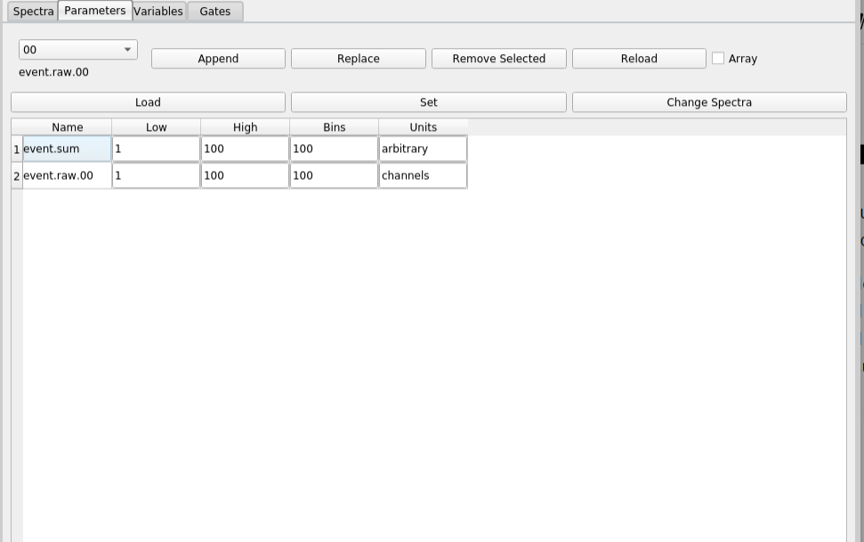

# The Parameters Tab

The ```Parameters``` tab allows you to see and modify the metadata associated with paraemters.
Each parameter optionally has the following metadata:

*  ```Low``` The recommended low limit for axes that are defined on this parameter.
* ```High``` The recommended high limit for axes that are defined on this parameter.
* ```Bins``` The recommended number of bins between [Low, High).
* ```Units``` The units of measure of the parameter.

Modifying these metadata will modify the axis definitions that the GUI will suggest for spectra you define with the [Spectrua tab](./chap4_1.md).

Let's have a look at the ```Parameters``` tab:




The top part of this GUI contains a parameter chooser and a bunch of buttons.  The bottom part, contains
a tabular list of parameters and their metadata.  You determine which parameters are displayed.

You can edit the contents of the table as follows:
*  Clicking the ```Append``` button adds a new row to the table that will contain the paramete metadata for the parameter currently selected in the parameter chooser.  If the Array checkbox is selected, the parameter is assumed to be  a member of an array of parameters and lines are added for all parameters in the array.
*  Clicking the ```Replace``` button will replace the current selected row in the table with the parameter that is selected in the parameter chooser.  Only one parameter line may be selected for this
to  operate.
*  Clicking ```Remove Selected```  will remove all selected rows from the table.

Once the table is populated; you an select any number of rows.  THe selection can be non-contiguous as well.  You can also edit the metadata by typing into the metadata cells in the table.  The ```Reload``` button will Reload the metadata for all table cells.

The following button operate on the selected rows of the table:

*   ```Load``` - loads the parameter metadata for the selected cells from the server.
*   ```Set```  - Sets the parameter metadata for the selected cells into the server.
*   ```Change Spectra``` Uses the metadata in the selected parameters to re-define the axis specifications for spectra that use any of the selected parameters.  You will be prompted to confirm along with the names of the affected spectra.