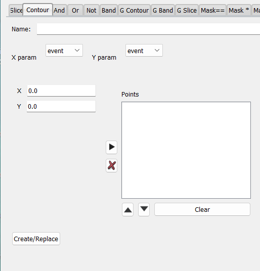

# The Gate Tab

The gate tab can be used to define rustogramer conditions (gates in SpecTcl).  Conditions are entities that, per event, are either true or false.  A single condition can be applied to a spectrum (of course the same condition can be applied to as many spectra as you like).  If a spectrum has a condition applied to it, it will only increment for events for which it's applied condition (in rustogramer this is called a gate) is true (of course the parameters needed to increment the histogram must also be present in the spectrum). 

With respect to primitive conditions, an important, and often forgotten point is that conditions are not defined on spectra, even if a displayer like *CutiePie* was used to create the condition. It is defined on one or more *parameters*.  For example, a slice condition is true for events where its *parameter* lies within its limits.   A condition may be *displayable* on a spectrum but is **never** defined on it.

Let's look at the Gates tab when the Gui is attached to Spectcl.  SpecTcl defines  a few condition types that rustogramer does not implement.  Therefore not all of the gate editor tabs visible in the picture below will be available if the GUI is used to control rustogramer.


Key features to note:

* At the top of the Gates tab are a set of tabs. Each tab is labeled with a condition type.  Clicking on tabs allows you to display a condition editor for that condition type. 
* At the bottom is a table of conditions and their properties.  
    *   The ```Filter``` button updates the table, only displaying the conditions whose names match the pattern.
    *   The text input to the right of the ```Filter``` button allows you to edit a pattern which ```Filter``` will match names against.  The filter string can contain any of the wild-card characters used in file system name matching (e.g by ```ls```).
    *   The ```Clear``` button clears the pattern to ```*```, which matches all names and upates the table.
* The table supports selecting an arbitrary  number of conditions. The selection, need not be contiguous.  The table is *not* editable. 

The buttons between the editor and table manipulate selected condition(s) in the table:

*  ```Delete Selected``` deletes the selected gates.  The behavior of spectra that use that condition as a gate or conditions that depend on that condition differs somewhat between SpecTcl and rustogramer
    *   In SpecTcl, a deleted condition is replaced with a **False** condition.
    *   In rustogramer deleted conditions are really deleted and:
        *  Spectra gated by that condition become ungated on the  next event.
        *  Conditions that depend on that condition operate in a manner depending on their type:
            *  *Not* conditions will always return **false** if the condition they depend on is deleted.
            *  *And* conditions will always return **false** if any condition they depend on is deleted.
            *  *Or* conditions will return a value that depends on the values of the remaining conditions, that is if any remaining condition is *true* they will return *true*, but if all remaining conditions are *false* the condition evaluates as  *false*.  Thus you can treat the deleted condition as if it were a **false** condition.
*  ```Load Editor``` requires that only one table item be selected.  The tab for the selected condition type is selected and the condition is loaded into the editor.  This allows for:
    *  Edits to the condition that do not change its type.
    *  Creation of new conditions that start from the same definition as an existing condition (e.g. a slice with the same parameter but a different acceptance region).
* ```Delete Displayed``` Deletes the condition currently displayed in the editor.

You might wonder how you can edit a condition to change its type.   Simply edit a condition with a different type but the name of the condition you want to change.  When you save the edited condition, it will transparently replace the previous condition and:
*  Any spectrum gated on the old condition will now be gated on the new condition.
*  Any condition that depended on the old condition will not depend on the new one.

The sections below describe the various types of condition editors:

* [Slice editor](#slice-conditions)
* [Contour editor](#contour-condition)
* [And and Or editor](#and-and-or-conditions)
* [Not editor](#not-conditions)
* [Band editor](#band-conditions)
* [Gamma band and contour editors](#gamma-bands-and-contours)
* [Gamma slice editor](#gamma-slice-conditions)
* [Bit mask conditions](#bit-mask-conditions)
* [True/false conditions](#true-and-false-conditions)

## Slice conditions

Slice conditions are defined on a single parameter.  Slices have an *acceptance region* defined on that parameter.  
*  If the parameter the slice is defined on is not defined in an event, the slice is **false**
*  If the parameter the slice is defined on is defined in an event, the slice is true if the parameter value lies within the acceptance region.

Here's what the slice editor looks like:


The name entry allows you to provide a name for the condition.
The parameter chooser allows you to select the parameter the condition is defined on and the ```Low``` and ```High``` editors allow you to specify floating point limits for the condition's acceptance region.

Clicking the ```Create/Replace``` button creates a new condition or replaces an existing one with the same name if it iexists.

If you are using a displayer like CutiePie, it is often easier to create a slice gate by drawing it on a spectrum which displays the desired parameter.  The displayer will convert screen coordinates to parameter coordinates and ask rustogramer or SpecTcl to create/replace the appropriate slice gate.

## Contour condition

Contour conditions are defined on two parameters.  These two parameters define a plane in parameter space. A contour then is a closed polyline on that plane.  Contour conditions are true when:

*   Both parameters are defined for the event.
*   The point defined by the ordered pair of parameters is *inside* the closed polyline.

It is possible to draw quite pathalogical polylines with corssing lines.   I have seen use cases where this is important (hour-glass shaped contours to accept any point in either lobe of the hourglass).  It is therefore important to carefully define waht *inside* means for arbitrary figures.

*Definition*:  A point is inside a contour if, extending a line in any direction crosses an odd number of lines that compose the contour.

This definition of *insided-ness* is used by both SpecTcl and Rustogramer.

Here's what the contour editor looks like:



*  As usual, at the top of the editor, you can type in the contour name.
*  Parameter choosers allow you to specify the X and Y parameters that define the parameter plane.
*  The two entries labeled ```X``` and ```Y``` let you enter floating point values for points on the polyline that define the contour.   Clicking the right arrow button adds a point to the list of points to the right.  The list can be edited using the ```X``` button to remove selected points, the up and down arrows to move selected points up or down in the list and the ```Clear``` button to clear the list.
Note that you do not need to close the  polyline.  An implied additional line is created joining the first an last points.
*  Clicking ```Create/Replace``` creates the named contour or replaces a condition with the same name.

## And and Or conditions.

These two condition types are defined on an arbitrary number of dependent conditions.  There is no requirement that the dependent conditions be primitive conditions.  You can use these (in conjunction with *Not* conditions) to build up arbitrarily complex condition logic.

*  *And* conditions are true for events that make *all* dependent conditions true
*  *Or* conditions are true for events that make *any* dependent condition true.

Here's what the editor for *And* and *Or* conditions looks like (same editor is used for both types):


* The name entry at the type, as usual, allows you to enter a name for the condition.
* The condition selector allows you to chose a conditions which you then add to the list of dependent conditions by clicking the right arrow.
*  You can edit the list of dependent conditions using the usual controls for lists of this sort.
*  Clicking ```Create/Replace``` creates the new gate (or replaces one with the same name).

## Not conditions

Not conditions depend on a single condition.  They return the inverse value of their dependent condition.  If their dependent condition is true, they return false.  If the dependent condtion is false, they return true.  

The dependent condition can be any type of condition.  For example you can construct a Nand condition by defining and And condition and making it the dependent condition.

The editor for Not conditions is very simple:


Fill in the name of the condition at the top, select the dependent condtion from the Gate: drop-down menu and click ```Create/Replace``` to create the new condition or to replace any existing condition with the same name.

## Band Conditions

Band conditions are similar to [Contour conditions](#contour-condition).  The difference is the meaning of the points accepted.  For a contour condition, one needs at least three points to define a closed figure and events where the parameters are inside the closed figure make the condition true.  For band conditions, you need at least two points and the condition is true for events that make points below at least one line segment.  Note that if you define a polyline with backtracking, this means that points lower than the highest segment the point is above rules.

The band editor looks, and functions exactly like the contour editor:


The only differences are:
*   The condition only requires two points.
*   A band condition is created rather than a contour.

## Gamma bands and contours

Gamma bands and contours are defined on at least two parameters.  The operate like band and contours, however all ordered pairs of paramters are checked to see if satisfy the band or contour condition.

Both use the same editor:


As you can see, in addition to the controls present for a contour or band editor, the Gamma band/contour editor provides for an arbitrary list of parameters to be accumulated.

## Gamma slice conditions

A gamma slice is like the or of several identical slices on different parameters but with the same acceptance region.  Here's the gamma slice editor:


In addition to the name and acceptance regions needed for a slice condition, this editor allows you to accumulate an arbitrary list of parameters on which the slice will be evaluated.  If any parameter is inside the acceptance region the condition evaluates as True.

## Bit mask conditions

Bit mask conditions treat a parameter as an integer set of bits.  When you define a bitmask condition you define a mask of bits.  The condition is satisfied depending on the bits set in the parameter and the mask:
*  ```Mask==``` are satisfied if the parameter is equal to the mask (SpecTcl ```em``` gate)
*  ```Mask*``` are satisfied if the parameter anded with the mask is equal to the mask (the paramter has all bits set the mask has) (SpecTcl ```am``` gate).
*  ```Mask-``` are satisfied if the parameter anded with the bitwise complement of the mask is equal to the bitwise compllement of the maski (SpecTcl ```nm``` gate).

All of these bit mask conditions share the same editor:


After choosing a name and parameter for the condition, check the bits that are set in the mask.  As usual the ```Create/Replace``` button creates the new condition, if necessary replacing any existing condition with the same name.

## True and False conditions

True and False conditions are generally used as placeholders.  As their names imply, True conditions are true for all events and False conditions are false for all events.  A normal use is that you anticipate you will gate a spectrum but don't yet know how.  You can create the spectrum, create a True condition and apply that to gate the spectrum.

When you know  how you will actually gate the spectrum, you can create a condition with the same name as your placholder True condition.  Since the gated spectrum is already gated on the correct condition you don't have to remember to apply the condition you just made.

True and False condition editors only differ in the type of condition initially set on them:


Note that if you change your mind about which condition type you are making, simple click the correct radio button.

