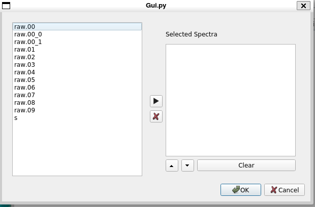
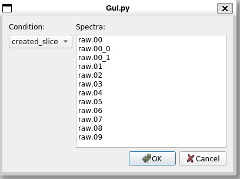

# The Spectra Menu

Many of the items on the ```Spectra``` menu are available on the ```Spectra``` tab and ```File``` menu.
THey are grouped here to make it unecessary to switch tabs to access them:

*  [Save spectrum contents.](#save-spectrum-contents)
*  [Read spectrum file](#read-spectrum-file)
*  [Clear All](#clear-all)
*  [Create](#create)
*  [Delete](#delete)
*  [Apply Gate](#apply-gate)


## Save Spectrum Contents.

This allows you to save the contents of one or more spectra to file.
See [The file  menu](./chap4_5.md#file-save-spectrum-contents) for a description of the user interface behind this.

## Read Spectrum File

Allows you to read a file that contains the contents of one or more spectra.  See
[The file maneu](./chap4_5.md#file-read-spectrum-contents) for a description of the user interface behind this.

## Clear all

Clears the contents of all spectra.  All spectrum channels are set to zero.

# Create

Allows you to create one or more spectra.  The spectrum editor tabbed widget is displayed.  When you are done creating the spectra you want, click ```Ok``` to dismiss the dialog.  A section of the Spectra Tab page describes how to use the [spectrum editors](./chap4_1.md#the-spectrum-editors)

# Delete

Allows you to delete one or more spectra.   You can select the spectra to delete using:



Simply select spectra (you can select more than one at a time). And click the ```>``` button to add it to the editable list box.  When the listbox contains the spectra you want to delete; click ```Ok``` to delete those spectra.

Improvements are planned to the spectrum selection  see issue [#170](https://github.com/FRIBDAQ/rustogrammer/issues/170)

You can achieve the same effect in the Spectra tab using the [Delete Button](./chap4_1.md#the-button-bar) on the Spectra tab button bar after selecting the spectra you want deleted from the spectrum listing in that tab.

# Apply Gate

Allows you to apply a gate/condition to one or more spectra;



Select the condition on the left and select however many spectra you want (selections need not be contiguous) on the right and click ```Ok``` to apply the gate to the selected spectra.