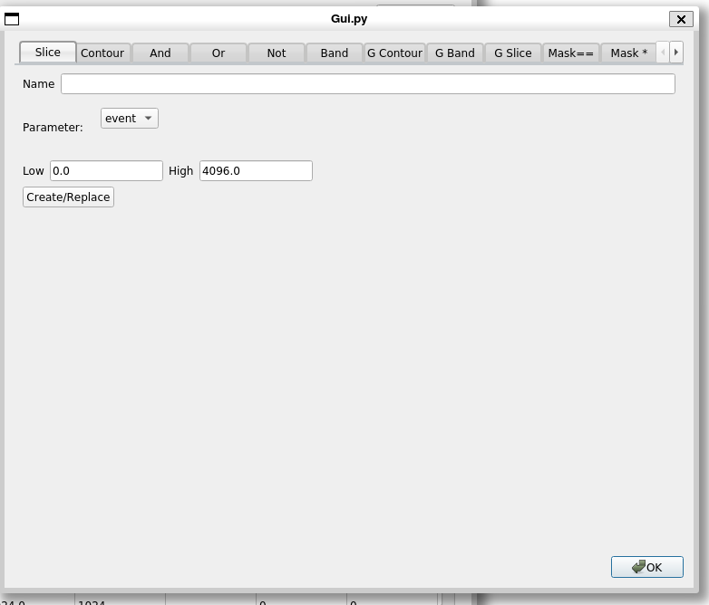
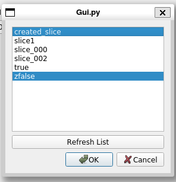

# The Gate Menu

Allows you to perform the folowing operations on gates.

*  [Create](#create-gates) one or more gates
*  [Apply a gate](#apply-gate) to one or more spectra.
*  [Delete](#delete-gate) a gate.


## Create gates

Selecting this brings up the tabbed window of the gate editors:



Use it to create as many gates as you want then dismiss it with the ```Ok``` button.
See the various gate editor descriptions in the [Gate Tab documentation](./chap4_4.md)

## Apply gate

  This functionality is the same as that in [the Spectrum menu](./chap4_7.md#apply-gate) 

## Delete gate
 
 Allows you to delete one or more gates.  

 

 Simply select the gates you wish to delete from the list in the dialog above and click ```Ok```to delete them.