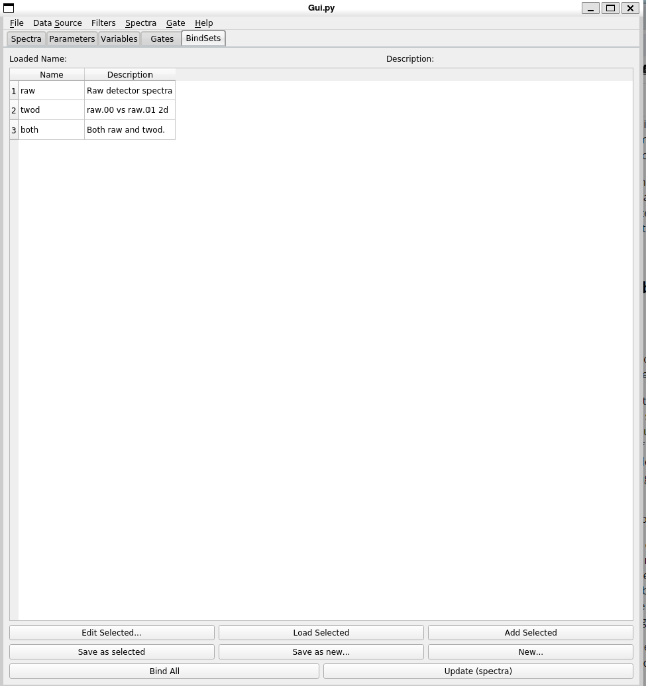
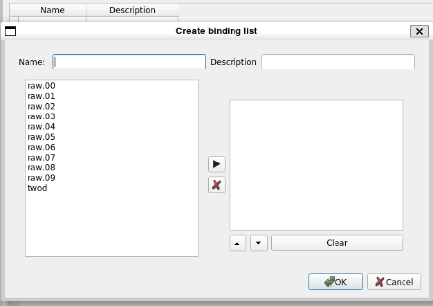

# The BindSets Tab

This section describes the Bindsets tab.  Before describing how to use that tab let's take a bit of time to
describe what a bindset it and why they can be useful.

Both SpecTcl and Rustogramer don't have intrinsic visualizers for their spectra.  These are supplied by external, programs such as CutiePie.  SpecTcl and Rustogramer both provide a display shared memory region in which spectra that can be visualized are stored.   The process of storing spectra in this shared memory is called ```sbinding``` and the process of removing a spectrum from the shared memory is called ```unbinding```.  Sbinding and unbinding have no effect on spectrum contents.

Both Spec Tcl and Rustogrammer can support as many spectra and as much spectrum data as virtual memory allows.  *However*  the shared memory size is fixed at program start.  In the past, SpecTcl GUIs attempted to just sbind all spectra.  As analysis becomes more complex and the amount of spectrum storage increases, this is less and less feasible.  Thus bindsets.

## What are bindsets

 A bindset is:

 *  A name
 *  A description
 *  A list of spectra.

 The GUI supports loading bindsets into shared memory (either first unbinding the spectra in shared memory first or supplementing the set of spectra already sbound int shared memory).   Think of a bindset as a group of spectra that you will tend to want to look at for some period of time.  The idea is that the set of spectra you need to see when you are setting up an experiment, debugging detectors and electrons, may well be different from the set of spectra you want to see at various points of running the experiment with beam.  Bindsets support loading only the spectra you want to see at any given time into the display shared memory.

 The Bindests tab supports:
 *  Saving the currently bound spectrum in a new or existing bindset.
 *  Creating a new bind set.
 *  Editing an existing bind set.
 *  Loading a bind set into shared memory.
 *  Adding the spectra in a bind set to those in shared memory.
 *  Attempting to sbind all spectra into shared memory.

 Furthermore, the ```File->Save...``` menu operation saves the bindsets you've defined to the database file and ```File->Load...``` loads them from the selected database file.

 ## The BindSets tab contents

 The BindSets tab looks like this:

 

 At the center of the user interface is a table (which becomes scrollable if needed).  The table lists the bind sets you have defined along with their descriptions.  At any time you
 can select one of the bind sets by clicking on it.
 
 If you have loaded a bindset, its name and description are loaded into the labels above the table.  The buttons that have the text ```Selected``` in their labels require that you have selected a bindset in the table and operate on the selected bindset.

 The buttons are in logical rather than visual order:

 * [New...](#new-bindset) - makes a new bindset.
 * [Edit Selecteed...](#edit-bindset) - edits the selected bindeset.
 * Load Selected - Loads the selected bindset in to shared memory after first unbinding any spectra that are there.
 * Add Selected - Attempts to add the selected bindest to those in shared memory.
 * [Save as selected...](#save-selected) - Save the currently bound spectra to the selected bindset
 * [Save as new...](#save-new) - Save the currently bound spectra to a new bindset.
 * Bind All - attempts to  bind all defined spectra to the display memory.
 * Update (spectra) - updates the spectra known to the bindset editors from the histogramer

 ### New bindset

Clicking the ```New...``` button pops up a dialog that contains the bind set editor:



At the top are entries for the bindset name and description. The description can be omitted, though this is not recommended.  The bindset name is mandatory.

The list at the left of the editor is the list of spectra that can be put into the bind set. It's called the source list.  The list at the right is the set of spectra you've currently got in the bind set.  Add spectra to the bindset by selecting any number of spectra from the source list and clicking the right arrow button between the two lists.  When you do this the spectra are removed from the source list and appended to the right listbox.   

You can also select spectra from the right box and click X to remove them (they will be added 
back to the source list).  The Clear button removes all spectra from the right list adding 
them back to the source list.  The up/down arrows move the selected spectra up or down in the
right list box and are just there to allow you to organize that box.

When you are happy with the bindset you've created, click the Ok button.  To abort the creation of the bind list, click the Cancel button.

 ### Edit bindset

 The ```Edit Selected...``` button also pops up the bind set editor described in
 the [New bind set](#new-bindset) section.  However, the editor is first populated with the 
 name and description of the selectged bind set. The right list box is populated with the spectra in the bind set and those spectra do not appear in the source list.

 ### Save selected

 Pops up the bind set editor with the name and description of the editor populated from the selected bindset but the right listbox, populated from the spectra that are currently bound in the shared memory.

 ### Save new

 Pops up the bind set editor with the name and description not populated but the right listbox populated from the spectra currently bound to shared memory.

