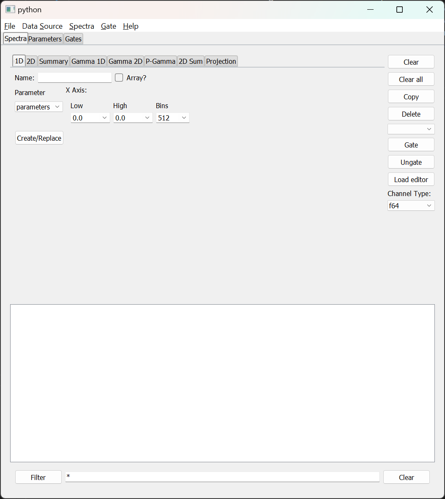

# Chapter 4 - Using the Rustogramer GUI

Rustogrmer suplies a sample GUI that is based on the NSCLSpecTcl treegui with, what I think are, some improvements in how objects are creatd. The GUI is a sample of a REST client written in Python against the [Python Rest API](./chap6_2.md).

If the envirionment variable ```RUST_TOP``` is defined to point to the top installation directory of Rustogramer, you can run the gui as follows:

```bash
$RUST_TOP/bin/gui [--host rghost] [[--port rest_port] | [--service rest_service] [--service-user rg_user]]
```

The gui supports the following command options

*  ```--host``` specifies the host on which the rustogramer you want to control is running.  This defaults to ```localhost``` if not specified.
* One of two methods to specify the REST port that Rustogramer is using:
    * ```--port``` specifies the numeric port on which Rustogramer's REST server is listening.  This defaults to ```8000``` which is Rustogrammer's default REST port.
    *  If rustogramer is using the NSCLDAQ port manager to advertise a service name:
        *   ```--service```  specifies the name of service rustogramer is advertising.
        *   ```--service-user``` specifies the name of the user that rustogramer is running under.  This defaults to your login username and, in general, should not be used.

When connected to Rustogramer, the GUI will look like this:


Prior to describing each of the user interface elements let's look at a few features of this image.
